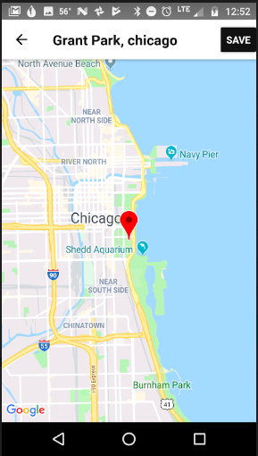

# ADDRESS BOOK

  

## Setup

### Prerequisites

Follow the *React Native CLI Quickstart* prerequisite instructions located [here](https://facebook.github.io/react-native/docs/getting-started). You will need Node, TypeScript, Watchman, React Native command line interface, Xcode, CocoaPods, JDK 8, Android Studio and the Android SDK. 

### Environment Variables

Create a file named `.env` and add your Google Maps API key. Enable **Maps SDK for Android**, **Maps SDK for iOS** and **Geocoding API** for your Google Cloud Project. You *must* enable billing on your Google API key to run more than one geocode request.

```
GOOGLE_MAPS_API_KEY=YOUR_KEY_HERE
```

### Running the App

Install dependencies:

```
npm install
cd ios
pod install
cd ..
```

Use the following commands to start up the app on your emulator or device:

**Android**

```
react-native run-android
```

**iOS**

```
react-native run-ios
```

### Reloading the App

In the Android emulator, tap `rr` to reload. On an Android device, shake the device forward and backward a couple of times to display the menu. Tap **Reload**. Enable **Live Reload** from the menu to automatically update the app when changes are made.

> NOTE: When changing platform specific properties, you will still need to restart the local server.

## VS Code Configuration

If you're using VS Code, add the following to your workspace settings to remove TypeScript warnings.

```
{
    "javascript.validate.enable": false
}
```

## Resources

### React Navigation

https://reactnavigation.org/docs/en/getting-started.html#installation

### React Native Config

This library is used to hide environment variables like the Google Maps API key. 

https://github.com/luggit/react-native-config

### React Native Maps

https://github.com/react-native-community/react-native-maps

### SQLite

https://brucelefebvre.com/blog/2018/11/06/react-native-offline-first-db-with-sqlite/

### Podfile Setup

http://facebook.github.io/react-native/docs/integration-with-existing-apps

### Offline First Storage Options

https://www.simform.com/react-native-database-selection-guide/